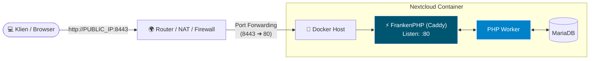
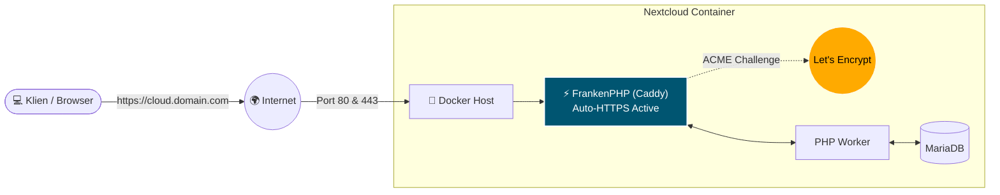
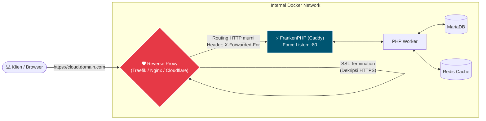

# Nextcloud High-Performance Stack (FrankenPHP + Alpine Linux)

An enterprise-ready, ultra-lightweight, and modern Nextcloud deployment wrapper. This stack utilizes **FrankenPHP** (a high-performance PHP application server built on top of the Caddy web server) compiled on **Alpine Linux** to ensure extremely low memory footprint, HTTP/3 support natively, and worker-mode performance.

This repository features an intelligent `entrypoint.sh` startup script that automatically provisions Nextcloud, generates Caddy configurations on-the-fly, enforces rigid security policies, and wires up companion microservices (Redis, ONLYOFFICE, Notify Push, and Elasticsearch).

---

## 🚀 Key Features

* **FrankenPHP Application Server:** Eliminates the overhead of separate Nginx and PHP-FPM processes by bundling web serving and PHP execution into a single Go-backed binary.
* **Alpine Linux Substrate:** Minimal attack surface and lightning-fast container boots.
* **Intelligent Auto-Configuration:** Automatically synchronizes Nextcloud's `config.php` database states with given environment parameters (Trusted Domains, Trusted Proxies, Overwrite Protocols).
* **Atomic Security Hardening:** Enforces Strict-Transport-Security (HSTS), blocks access to sensitive framework folders (`/build`, `/config`, `.ht*`), and pre-caches static assets.
* **Zero-Sed Database Integration:** Configures apps via native Nextcloud `occ` commands instead of fragile runtime configuration regex parsing.

---

## 🛠️ Environment Variables Config Matrix

Control the entire stack lifecycle by tweaking these environment variables in your deployment files:

| Variable | Default | Description |
| :--- | :--- | :--- |
| `NC_DOMAIN` | `:80` | Target domain or port syntax (e.g., `cloud.example.com` or `:80`). |
| `REVERSE_PROXY` | `no` | Toggle `yes` if deploying behind external proxies (Traefik, Nginx, Cloudflare Tunnel). |
| `FORWARD_PORT` | *None* | External port if your network maps non-standard public ports (e.g., `8443`). |
| `NC_HOST` | *Required* | Internal service name of the Nextcloud container used for companion calls. |
| `ONLYOFFICE_HOST` | *Optional* | Container/Host address for ONLYOFFICE Document Server integration. |
| `NOTIFY_PUSH_HOST`| *Optional* | Container/Host address running Nextcloud's high-performance websocket client. |
| `ELASTICSEARCH_HOST`|*Optional* | Full URL/Host of an Elasticsearch node to initialize Full-Text Search. |
| `REDIS_HOST` | *Optional* | Hostname of a Redis database to activate distributed caching and transactional locking. |
| `REDIS_PASSWORD` | *Optional* | Authentication password for the connected Redis node. |

---

## 📋 Deployment Scenarios Setup Guide

Choose the deployment architecture block that exactly matches your underlying hosting infrastructure:

### Scenario 1: IP with Custom Port Forwarding (Local / Home Lab)
Best suited for local network testing, home labs, or environments behind NAT routers forwarding a custom external port to the server.


* **Behavior:** The script uses your server's public/local IPv4 seamlessly, configures Nextcloud to allow access through the forwarded custom port, and retains standard HTTP communication internally while keeping link rendering properly configured.
* **Configuration Snippet** (`.env` or `docker-compose.yml`)

```yaml
environment:
  - NC_DOMAIN=:80
  - REVERSE_PROXY=no
  - FORWARD_PORT=8443 # Sent to router's external facing port
  - PHONE_REGION=ID
```

### Scenario 2: Standalone Domain (Direct Public HTTPS via Caddy)

Ideal for servers directly exposed to the internet with ports 80 and 443 fully open. Caddy inside FrankenPHP will automatically obtain and renew TLS certificates via Let's Encrypt / ZeroSSL.



* **Behavior:** Activates automatic HTTPS. Caddy serves production traffic natively over HTTP/2 and HTTP/3.

* **Configuration Snippet** (.env or docker-compose.yml):

```YAML
    environment:
  - NC_DOMAIN=cloud.yourdomain.com
  - REVERSE_PROXY=no
  - PHONE_REGION=ID
```
Scenario 3: Domain Behind an External Reverse Proxy (Traefik, NPM, Cloudflare)

Standard production enterprise deployment where an edge load balancer or central reverse proxy handles SSL termination and directs traffic downstream to this container.



* **Behavior:** Forces Caddy to listen strictly on port 80 to prevent ACME conflicts. Injects trusted_proxies configuration block automatically tracking the container gateway network (172.16.0.0/12 equivalents) along with your WAN IPv4/IPv6 addresses. Enforces Nextcloud to generate all system links explicitly over https.

* **Configuration Snippet** (.env or docker-compose.yml):

```YAML
environment:
  - NC_DOMAIN=cloud.yourdomain.com
  - REVERSE_PROXY=yes
  - NC_HOST=nextcloud_app # Internal service name
  - PHONE_REGION=ID
```

### Hi there! Thanks for stopping by. 👋

Your contribution means the world to me—it keeps the servers running and the code flowing. Thank you so much for backing my open-source journey and being a vital part of this community!

professional support available @ [ko-fi](https://ko-fi.com/icalbakhri) 📫 [email](mailto:icang@duck.com)

With ❤️ from Indonesia 🇮🇩 - other projects visit [log.ical.web.id](https://log.ical.web.id) 

[](https://ko-fi.com/S7Q61ZO75K)
